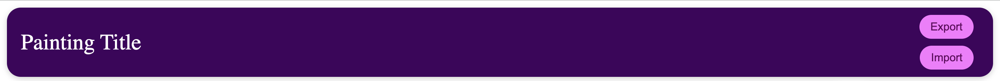
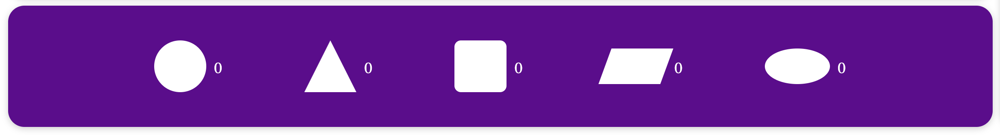

نام و نام خانوادگی: امیرمحمد درخشنده - شماره دانشجویی: ۴۰۰۱۰۱۱۵۳

نیمسال تحصیلی دوم سال ۱۴۰۳-۰۴ - تمرین دستگرمی سری دوم
نام استاد درس: استاد پورسلطانی

## گام اول: ساخت پروژه

در گام اول، با استفاده از دستور

```
npx create-react-app .
```

## گام دوم: ساخت Template اجزای اصلی صفحه

می‌توانیم یک پروژه ری‌اکت بسازیم. بعد از انجام این عمل، برای هر کدام از باکس های پروژه(شامل header، اسلایدبار و ...)، نیاز است تا یک فایل جداگانه بسازیم(در نظر داشته باشید که اگر هر component، به صورت مجزا و در فایل جداگانه ای ساخته شود، ظاهر و شمایل پروژه، بسیار خواناتر و واضح‌تر خواهد بود). از آن‌جایی که چهار component اصلی(header, canvas, slidebar, counterBox) داریم، برای هر کدام، یک فایل js به همراه یک فایل استایل می‌سازیم(البته در رابطه با استایل ها، می‌توان همگی را در یک فایل قرار داد، اما در این پروژه، من فایل های استایل را نیز جداگانه ساختم، چرا که اجزای چندان زیادی نداریم و به لحاظ شلوغی پروژه از دیدگاه تعداد فایل ها، دچار مشکل نخواهیم شد).

در نهایت، داخل فایل js هر کدام، باکس مورد نظر را(در قالب یک div) می‌سازیم و استایل آن‌را(که مهم‌ترین قسمت استایل، رنگ و فواصل از حاشیه‌ها هستند) در فایل متناظر، وارد می‌کنیم.


## گام سوم: طراحی هدر

در گام سوم، به طراحی باکس هدر متناسب با نیازمندی های پروژه خواهیم پرداخت. سه عنوان اصلی برای این باکس مورد نیاز است: نام فایل، دکمه import و دکمه export. برای طراحی این سه عنوان، داخل فایل header.js، تغییرات را می‌توان ایجاد کرد. به منظور ساخت عنوان، از یک div با نوشته فرضی و اولیه Painting Title استفاده می‌کنیم. همچنین برای دکمه ها، از Button با کلاس btn استفاده می‌کنیم. توجه داشته باشید که دکمه هارا در یک باکس با نام کلاس btn-group قرار می‌دهیم و در استایل این باکس، flex-direction را با columns، مقداردهی می‌کنیم تا دکمه ها، زیر هم قرار بگیرند. همچنین در تنظیمات استایل، دکمه هارا سمت راست باکس header و نام فایل را در سمت چپ می‌اندازیم. برای جلوه زیبایی، حالت hover دکمه هارا با تغییر رنگ(یک پرده روشن‌تر) همراه می‌کنیم. در گام های بعدی، قسمت back باکس، تکمیل خواهد شد(عملیات های دکمه ها و تغییر نام فایل).



## گام چهارم: طراحی اسلایدبار(ابزار Tools)

در این بخش، با اضافه کردن یک نام(Tools) در بالای باکس و اشکال به صورت عمودی در زیر آن(توجه شود که برای هر شکل، یک کلاس مجزا برای مقداردهی ابعاد اضافه می‌کنیم)، کار را به اتمام می‌رسانیم. تمامی استایل ها، در فایل slidebar.css قرار خواهند داشت. به منظور زیبایی بیشتر، دو شکل جدید(بیضی و متوازی‌الاضلاع) نیز به ابزار اضافه شده اند و با بردن ماوس بر روی هر شکل، ابعاد شکل با استفاده از transition ۰.۲ ثانیه‌ای، کمی بزرگتر خواهد شد(هر بعد، به اندازه ۵ پیکسل).

## گام پنجم: افزودن پارامتر های counter box

در این بخش، نیاز است تمامی اشکالی که در Tools داشتیم را به همراه یک شمارنده در کنار آن، اضافه کنیم. هر کدام از اعداد، نمایش‌گر تعداد اشکال استفاده شده خواهد بود(و طبعا در ابتدا برابر با ۰ هستند). برای این کار، یک div با کلاس counter-shapes-row خواهیم ساخت تا با دادن استایل مناسب، تمامی پارامتر های موجود را در کنار هم(به صورت افقی) قرار دهیم. سپس، برای هر شکل، یک div با کلاس counter-shape-item خواهیم ساخت تا داخل هر کدام، ظاهر شکل به همراه شمارنده آن‌را قرار دهیم(برای ایجاد یک‌دستی باکس). گپ ای بین counter-shape-item ها نیز قرار می‌دهیم تا فواصل آن‌ها متناسب با عرض خود باکس اصلی، رعایت شود. برای جلوه ظاهری نیز، با بردن ماوس بر روی هر کدام از اشکال، ابعاد آن شکل کمی بزرگتر خواهد شد(مشابه Tools). نمایی از counter box را می‌توان در شکل زیر، مشاهده کرد:


